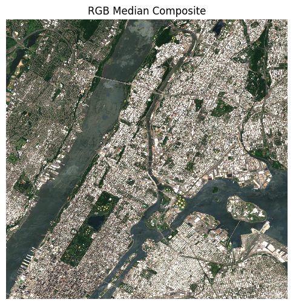
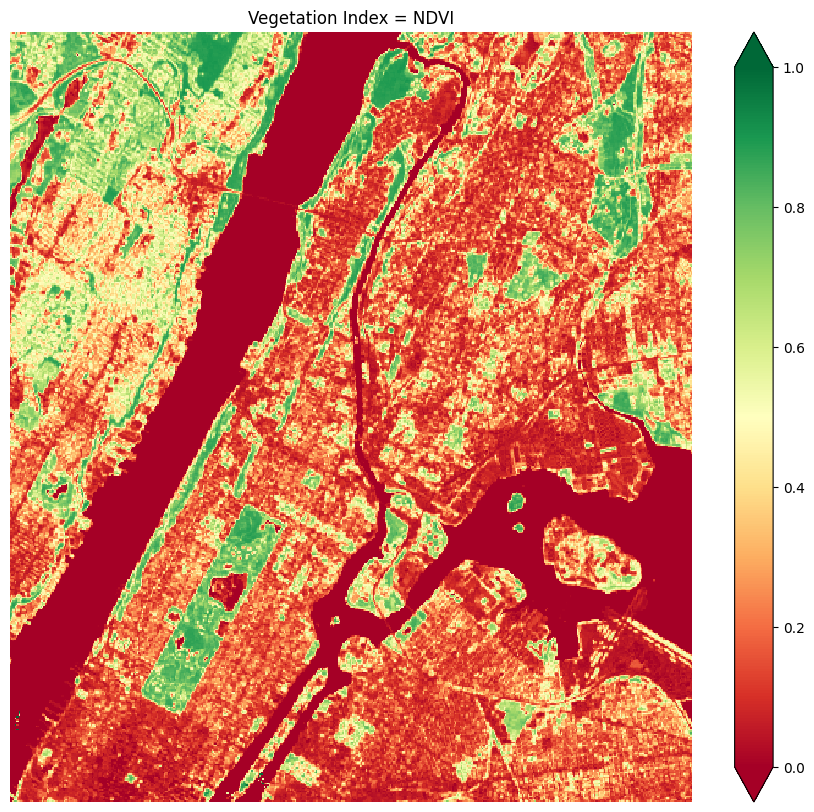

# EY Open Science AI & Data Challenge 2025 - Urban Heat Island Prediction


## Overview
This repository contains my submission for the **EY Open Science AI & Data Challenge 2025**, where I developed a machine learning model to predict **Urban Heat Island (UHI) hotspots**. My solution ranked in the **top 120** globally with an **R² score of 93.83%**.

## About the Challenge
The EY Open Science AI & Data Challenge is an annual competition aligned with the **United Nations Sustainable Development Goals** and the **EY Ripples program**. This year's challenge focused on mitigating the **Urban Heat Island (UHI) effect**, a phenomenon where urban areas experience significantly higher temperatures due to **dense infrastructure and limited vegetation**.

## Problem Statement
The goal was to build a **regression model** to predict UHI Index values for various locations within **New York City**. The dataset provided contained:
- **Latitude & Longitude** of measurement points
- **UHI Index values** (temperature deviations from the city’s average)
- **Temporal satellite data** (used in my approach)

The model aimed to **identify key factors** contributing to urban heat intensity and help urban planners develop cooling strategies for affected areas.

## My Approach
I designed a **machine learning pipeline** leveraging **temporal satellite data** and geospatial analysis to improve prediction accuracy. Key steps included:

### 1️⃣ Data Preprocessing
- Cleaned and structured **spatial and temporal** data
- Performed **feature extraction from Sentinel-2 and Landsat satellite data** over a period of time
- Engineered features from satellite observations, including vegetation indices (NDVI), land surface temperature (LST), and urban surface characteristics etc.




### 2️⃣ Model Selection & Training
- Explored multiple regression models
- Fine-tuned a **gradient boosting model** for optimal performance
- Achieved an **R² score of 93.83%**

### 3️⃣ Insights & Visualization
- Identified key contributors to UHI variations

## Results
- **Ranked in the top 120 globally, 2nd in the Africa Region**
- **R² Score: 93.83%**
- Received an **EY Certificate of Completion** for my participation

## Jupyter Notebook
The full analysis, including data preprocessing, feature engineering, model training, and visualization, is available in the Jupyter notebook:

📌 **[Final Notebook](final_notebook.ipynb)**

To explore the notebook:
1. Open it in Jupyter Notebook or Jupyter Lab.
2. Follow the step-by-step workflow to understand how the model was built.
3. Modify parameters and rerun the cells to experiment with different approaches.

## Next Steps
While I did not advance to the **Top 20 Phase**, this challenge provided valuable insights into **climate-focused AI applications**. Future improvements could include:
- **Incorporating real-time temperature data**
- **Exploring deep learning approaches** for enhanced feature extraction
- **Applying the model to different urban environments**


## How to Run
1. Clone the repository:
   ```bash
   git clone https://github.com/ugorjiizu/urban_heat.git
   ```

## Acknowledgments
- **EY Ripples Program** for organizing this challenge
- Fellow participants for sharing innovative ideas
- Open-source geospatial and climate datasets

---
If you're interested in **climate AI, geospatial analytics, or urban sustainability**, feel free to connect! 🚀🌍

#AIForGood #UrbanHeatIsland #MachineLearning #DataScience #Sustainability
